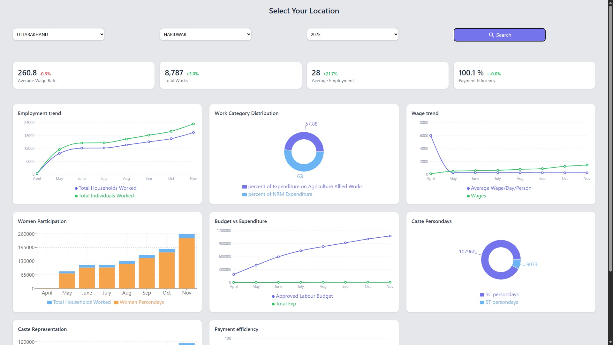

# MGNREGA District Performance Dashboard

A full-stack web application that enables citizens to easily understand and explore the performance of their district in the **MGNREGA (Mahatma Gandhi National Rural Employment Guarantee Act)** program. Designed for accessibility and large-scale use across rural India, the platform visualizes district-level data from the Government of India’s Open API in a simple and intuitive interface.

---

## 🌍 Project Overview

The **Government of India** provides an open API for monthly district performance under MGNREGA. However, the data is not easily accessible to non-technical users.  
This project bridges that gap by presenting the data in a **visual, easy-to-understand, and localized** web interface.

Citizens can:
- View **current and historical performance** of their district.
<!-- - **Compare** with other districts in the same state. -->
- Understand **key metrics** without technical knowledge.
- Access the site reliably, even when the government API is temporarily unavailable.

---

## 🔗 Live Demo

**Hosted URL:** [https://mgnrega.shaileshiitr.site/](https://mgnrega.shaileshiitr.site/)  
**GitHub Repository:** [https://github.com/Shailo2002/Bharat_Digital_Assignment](https://github.com/Shailo2002/Bharat_Digital_Assignment)

---

## 📹 Project Walkthrough

A short Loom video (under 2 minutes) demonstrates:
- The architecture
- The backend and database setup
- The API integration and caching logic
- The frontend interface and accessibility decisions

*[(Add your Loom video link here once available)](https://www.loom.com/share/1598a28e23684444bea6837bd0346a22)*

---

## 📁 Table of Contents

1. [Tech Stack](#-tech-stack)  
2. [Architecture Overview](#-architecture-overview)  
3. [Features](#-features)  
4. [Installation](#-installation)  
5. [Configuration](#-configuration)  
6. [Usage](#-usage)  
7. [Data Flow](#-data-flow)  
8. [Caching and Reliability](#-caching-and-reliability)  
9. [Deployment](#-deployment)  
10. [Screenshots](#-screenshots)  
11. [Troubleshooting](#-troubleshooting)  
12. [Contributors](#-contributors)  
13. [License](#-license)

---

## 🧩 Tech Stack

### Frontend
- **React (Vite)** – Fast and modular frontend framework.
- **Redux** – State management.
- **Tailwind CSS** – Utility-first CSS for responsive design.
- **Recharts** – Data visualization and charts.
- **React-AutoToast** – Notification and alert system.

### Backend
- **Node.js** with **Express.js** – REST API and server.
- **MongoDB** – Primary database for persistent data storage.
- **Redis** – Caching layer for performance optimization.
- **Cron (node-cron)** – Scheduled data fetching and synchronization.

### Hosting & Deployment
- Frontend deployed on **Vercel** for global CDN and scalability.
- Backend deployed on a **DigitalOcean Droplet** for full server control.
- Hosted on a **VM/VPS** for full control.
- **NGINX** or **PM2** used for reverse proxy and process management.
- **HTTPS** secured via free SSL (Let's Encrypt or similar).

---

## 🧠 Architecture Overview

```
                ┌────────────────────────┐
                │ Government Open API     │
                │ (MGNREGA Performance)   │
                └───────────┬─────────────┘
                            │
             Scheduled fetch (via Cron)
                            │
                ┌───────────▼────────────┐
                │ Node.js Backend (API)  │
                │ Express + Redis + Mongo│
                └───────────┬────────────┘
                            │
                     REST Endpoints
                            │
                ┌───────────▼────────────┐
                │ React Frontend (Vite)  │
                │ Redux + Recharts + UI  │
                └────────────────────────┘
```

---

## ✨ Features

- **District-wise visualization** of MGNREGA data.
- **Historical performance tracking.**
- **Automatic caching and API failover** using Redis.
- **Offline reliability:** Data fetched periodically via cron jobs.
- **Clean, responsive UI** designed for low-literacy users.
- **Toast notifications** for real-time feedback.
- **Optional geolocation detection** to identify user district.

---

## ⚙️ Installation

### Prerequisites
- Node.js >= 18.x  
- MongoDB instance  
- Redis server  
- npm or yarn

### Clone the Repository
```bash
git clone https://github.com/Shailo2002/Bharat_Digital_Assignment.git
cd Bharat_Digital_Assignment
```

### Backend Setup
```bash
cd backend
npm install
```

Create `.env` file in `backend/`:
```
PORT=5000
MONGO_URI=mongodb://localhost:27017/mgnrega
REDIS_URL=redis://localhost:6379
API_BASE_URL=https://example.gov.in/api
```

Start the backend:
```bash
npm run start
```

### Frontend Setup
```bash
cd frontend
npm install
npm run dev
```

Visit: `http://localhost:5173`

---

## ⚙️ Configuration

| Variable | Description |
|-----------|--------------|
| `PORT` | Port for Express server |
| `MONGO_URI` | MongoDB connection string |
| `REDIS_URL` | Redis cache server address |
| `API_BASE_URL` | Government API endpoint |
| `CRON_SCHEDULE` | Interval for automatic data refresh |

---

## 🚀 Usage

1. Select your **State** and **District**.
2. View visualized data on employment, work completion, and fund utilization.
<!-- 3. Compare performance with previous months. -->
3. Optionally allow **location access** to auto-detect your district.

---

## 🔄 Data Flow

1. **Cron job** fetches district-level data from the government API.
2. Data is stored in **MongoDB** and cached in **Redis**.
3. Frontend retrieves the data from the backend API.
4. Charts update dynamically based on user selection.

---

## 🧰 Caching and Reliability

- Redis used to serve frequently accessed district data.
- Cron ensures data freshness while minimizing API dependency.
- API throttling or downtime handled gracefully by fallback to cached data.

---

## 🌐 Deployment

- Backend deployed on a **Virtual Private Server (VPS)**.
- Frontend built and served via **NGINX**.
- **PM2** used for process management.
- Auto-renewing SSL certificate via **Certbot**.

---

## 🖼️ Screenshots


---

## 🧩 Troubleshooting

| Issue | Solution |
|--------|-----------|
| API timeout | Check government API status or Redis cache |
| MongoDB connection error | Verify `MONGO_URI` and network access |
| Redis not responding | Ensure Redis server is running |
| UI not loading | Check frontend build logs and network requests |

---

## 👨‍💻 Contributors

- **Shailesh** – Full-stack Developer  
  GitHub: [@Shailo2002](https://github.com/Shailo2002)

---

## 📜 License

This project is licensed under the **MIT License**.  
You are free to use, modify, and distribute it with attribution.

---

## 🧾 Notes

- Designed for large-scale production deployment.
- Optimized for low-bandwidth rural access.
- Prioritizes simplicity, clarity, and reliability.
